# Laporan K05 Praktikum Modul 1 Jaringan Komputer

### Kelompok K-05

| Nama | NRP |
| --- | --- |
| Ronnin Raditya Putra Purbono | 5027251119 |
| Keisya Halimah Mulia | 5027251068 |


# Daftar Isi

- [Ringkasan Topologi dan IP](#ringkasan-topologi-dan-ip)
- [Nomor 1: Membuat Topologi dan Konfigurasi Entity Client](#nomor-1-membuat-topologi-dan-konfigurasi-entity-client)
- [Nomor 2: Router Lain Terhubung ke Internet via NAT/DHCP eth0](#nomor-2-router-lain-terhubung-ke-internet-via-natdhcp-eth0)
- [Nomor 3: Routing Seluruh Client Antarsegmen](#nomor-3-routing-seluruh-client-antarsegmen)
- [Nomor 4: NAT MASQUERADE dan DNS untuk Seluruh Client](#nomor-4-nat-masquerade-dan-dns-untuk-seluruh-client)
- [Nomor 5: Konfigurasi Tetap Dapat Diverifikasi Setelah Restart](#nomor-5-konfigurasi-tetap-dapat-diverifikasi-setelah-restart)
- [Nomor 6: Generator Traffic DNS dan ICMP pada Mika](#nomor-6-generator-traffic-dns-dan-icmp-pada-mika)
- [Nomor 7: FTP Server Chisa: Alice RW, Mika Read-Only, Eiri Blacklist](#nomor-7-ftp-server-chisa-alice-rw-mika-read-only-eiri-blacklist)
- [Nomor 8: Knights Upload `knights_report.zip` ke FTP Chisa](#nomor-8-knights-upload-knights_reportzip-ke-ftp-chisa)
- [Nomor 9: Mika Download Dokumen dan Buktikan Read-Only](#nomor-9-mika-download-dokumen-dan-buktikan-read-only)
- [Nomor 10: Ping 77 Paket Knights ke Chisa](#nomor-10-ping-77-paket-knights-ke-chisa)
- [Nomor 11: Telnet Chisa dan Plaintext Credential](#nomor-11-telnet-chisa-dan-plaintext-credential)
- [Nomor 12: Netcat Scan Alice ke Knights](#nomor-12-netcat-scan-alice-ke-knights)
- [Nomor 13: SSH Passwordless Mika ke Knights](#nomor-13-ssh-passwordless-mika-ke-knights)
- [Nomor 14: Analisis HTTP Brute Force](#nomor-14-analisis-http-brute-force)
- [Nomor 15: Analisis USB HID Keyboard](#nomor-15-analisis-usb-hid-keyboard)
- [Nomor 16: Analisis FTP Theft](#nomor-16-analisis-ftp-theft)
- [Nomor 17: Analisis HTTP C2 / Malware Download](#nomor-17-analisis-http-c2--malware-download)
- [Nomor 18: Analisis SMB Malware Transfer](#nomor-18-analisis-smb-malware-transfer)
- [Nomor 19: Analisis SMTP Threat](#nomor-19-analisis-smtp-threat)
- [Nomor 20: Dekripsi TLS dengan Key Log File](#nomor-20-dekripsi-tls-dengan-key-log-file)


# Ringkasan Topologi dan IP

```text
NAT1
  |
  | eth0
 Lain
  ├── eth1 10.66.1.1/24 ── Switch1 ── Alice   10.66.1.2/24
  |                                  └─ Mika    10.66.1.3/24
  ├── eth2 10.66.2.1/24 ── Switch2 ── Chisa   10.66.2.2/24
  └── eth3 10.66.3.1/24 ── Switch3 ── Knights 10.66.3.2/24
                                     └─ Eiri    10.66.3.3/24
```

Gateway:

```text
Alice   -> 10.66.1.1
Mika    -> 10.66.1.1
Chisa   -> 10.66.2.1
Knights -> 10.66.3.1
Eiri    -> 10.66.3.1
```

DNS:

```text
nameserver 1.1.1.1
nameserver 8.8.8.8
```

# Nomor 1: Membuat Topologi dan Konfigurasi Entity Client

## Inti Soal

Lain bertindak sebagai router dan terhubung ke tiga switch:

```text
Switch1 -> Alice, Mika
Switch2 -> Chisa
Switch3 -> Knights, Eiri
```

Kelima entity dikonfigurasi sebagai client menggunakan prefix kelompok `10.66.x.x`.

## Konfigurasi

### Lain: Interface LAN

Pada Lain, simpan konfigurasi LAN:

```bash
cat > /etc/network/interfaces <<'EOF'
auto lo
iface lo inet loopback

auto eth1
iface eth1 inet static
    address 10.66.1.1
    netmask 255.255.255.0

auto eth2
iface eth2 inet static
    address 10.66.2.1
    netmask 255.255.255.0

auto eth3
iface eth3 inet static
    address 10.66.3.1
    netmask 255.255.255.0
EOF
```

Karena environment Lain yang digunakan tidak mengandalkan `service networking restart`, interface dapat diterapkan langsung:

```bash
ip link set eth1 up
ip link set eth2 up
ip link set eth3 up

ip addr flush dev eth1 2>/dev/null || true
ip addr flush dev eth2 2>/dev/null || true
ip addr flush dev eth3 2>/dev/null || true

ip addr add 10.66.1.1/24 dev eth1
ip addr add 10.66.2.1/24 dev eth2
ip addr add 10.66.3.1/24 dev eth3
```

Cek:

```bash
ip -br a
```

Ekspektasi:

```text
eth1  UP  10.66.1.1/24
eth2  UP  10.66.2.1/24
eth3  UP  10.66.3.1/24
```

### Alice

```bash
cat > /etc/network/interfaces <<'EOF'
auto lo
iface lo inet loopback

auto eth0
iface eth0 inet static
    address 10.66.1.2
    netmask 255.255.255.0
    gateway 10.66.1.1
EOF

ip link set eth0 up
ip addr flush dev eth0 2>/dev/null || true
ip addr add 10.66.1.2/24 dev eth0
ip route del default 2>/dev/null || true
ip route add default via 10.66.1.1 dev eth0
```

Cek:

```bash
ip -br a
ip route
ping -c 3 10.66.1.1
```

### Mika

```bash
cat > /etc/network/interfaces <<'EOF'
auto lo
iface lo inet loopback

auto eth0
iface eth0 inet static
    address 10.66.1.3
    netmask 255.255.255.0
    gateway 10.66.1.1
EOF

ip link set eth0 up
ip addr flush dev eth0 2>/dev/null || true
ip addr add 10.66.1.3/24 dev eth0
ip route del default 2>/dev/null || true
ip route add default via 10.66.1.1 dev eth0
```

Cek:

```bash
ip -br a
ip route
ping -c 3 10.66.1.1
```

### Chisa

```bash
cat > /etc/network/interfaces <<'EOF'
auto lo
iface lo inet loopback

auto eth0
iface eth0 inet static
    address 10.66.2.2
    netmask 255.255.255.0
    gateway 10.66.2.1
EOF

ip link set eth0 up
ip addr flush dev eth0 2>/dev/null || true
ip addr add 10.66.2.2/24 dev eth0
ip route del default 2>/dev/null || true
ip route add default via 10.66.2.1 dev eth0
```

Cek:

```bash
ip -br a
ip route
ping -c 3 10.66.2.1
```

### Knights

```bash
cat > /etc/network/interfaces <<'EOF'
auto lo
iface lo inet loopback

auto eth0
iface eth0 inet static
    address 10.66.3.2
    netmask 255.255.255.0
    gateway 10.66.3.1
EOF

ip link set eth0 up
ip addr flush dev eth0 2>/dev/null || true
ip addr add 10.66.3.2/24 dev eth0
ip route del default 2>/dev/null || true
ip route add default via 10.66.3.1 dev eth0
```

Cek:

```bash
ip -br a
ip route
ping -c 3 10.66.3.1
```

### Eiri

```bash
cat > /etc/network/interfaces <<'EOF'
auto lo
iface lo inet loopback

auto eth0
iface eth0 inet static
    address 10.66.3.3
    netmask 255.255.255.0
    gateway 10.66.3.1
EOF

ip link set eth0 up
ip addr flush dev eth0 2>/dev/null || true
ip addr add 10.66.3.3/24 dev eth0
ip route del default 2>/dev/null || true
ip route add default via 10.66.3.1 dev eth0
```

Cek:

```bash
ip -br a
ip route
ping -c 3 10.66.3.1
```

## Output yang Benar

Setiap client harus memiliki IP dan default gateway sesuai tabel. Ping gateway:

```text
3 packets transmitted, 3 received, 0% packet loss
```

## Screenshot

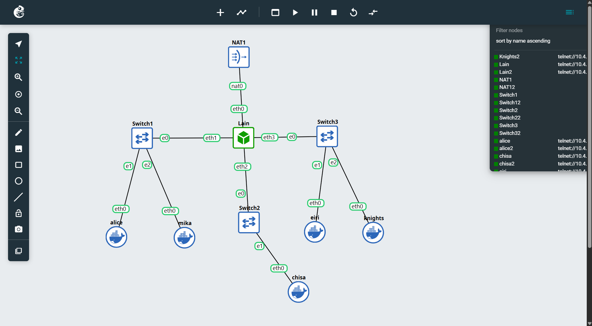


# Nomor 2: Router Lain Terhubung ke Internet via NAT/DHCP eth0

## Inti Soal

`eth0` Lain dihubungkan ke NAT1 dan memperoleh IP dengan DHCP.

## Konfigurasi

```bash
cat > /etc/network/interfaces <<'EOF'
auto lo
iface lo inet loopback

auto eth0
iface eth0 inet dhcp

auto eth1
iface eth1 inet static
    address 10.66.1.1
    netmask 255.255.255.0

auto eth2
iface eth2 inet static
    address 10.66.2.1
    netmask 255.255.255.0

auto eth3
iface eth3 inet static
    address 10.66.3.1
    netmask 255.255.255.0
EOF
```

Aktifkan eth0 dan minta lease DHCP:

```bash
ip link set eth0 up
ip addr flush dev eth0 2>/dev/null || true
udhcpc -i eth0
```

Jika `udhcpc` tidak tersedia tetapi `dhclient` tersedia:

```bash
dhclient eth0
```

### Troubleshooting: Lain belum mendapatkan IPv4 dari NAT

Setelah perintah DHCP dijalankan, `eth0` pada Lain sempat belum mendapatkan IPv4/default route dari NAT. Akibatnya Lain dan client belum bisa keluar ke internet.

Error/indikasi yang dicek:

```bash
ip -br a
ip route
ping -c 3 8.8.8.8
```

Indikasi error:

```text
eth0 belum memiliki IPv4 dari NAT
atau default route belum mengarah ke NAT
atau ping 8.8.8.8 gagal
```

Penyelesaian:

```bash
ip link set eth0 up
ip addr flush dev eth0 2>/dev/null || true
udhcpc -i eth0
ip route
ping -c 3 8.8.8.8
```

Set resolver:

```bash
cat > /etc/resolv.conf <<'EOF'
nameserver 1.1.1.1
nameserver 8.8.8.8
EOF
```

## Verifikasi

```bash
ip -br a
ip route
ping -c 3 8.8.8.8
ping -c 3 google.com
```

Ekspektasi:

```text
eth0 memperoleh IPv4 dari NAT
default route keluar melalui eth0
8.8.8.8 berhasil
google.com berhasil
```

## Screenshot

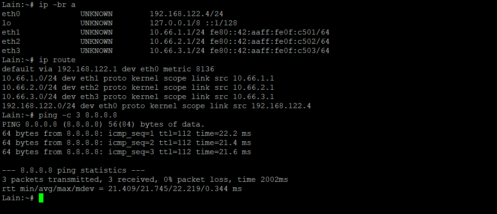

# Nomor 3: Routing Seluruh Client Antarsegmen

## Inti Soal

Semua client harus dapat saling berkomunikasi melalui Lain.

## Konfigurasi Lengkap

Aktifkan IPv4 forwarding pada Lain:

```bash
sysctl -w net.ipv4.ip_forward=1
```

Cek:

```bash
sysctl net.ipv4.ip_forward
```

Ekspektasi:

```text
net.ipv4.ip_forward = 1
```

Konfigurasi IP/gateway seluruh client menggunakan konfigurasi No.1.

## Uji Antarsegmen pakai

Contoh dari Alice:

```bash
ping -c 3 10.66.2.2
ping -c 3 10.66.3.2
ping -c 3 10.66.3.3
```

Contoh dari Chisa:

```bash
ping -c 3 10.66.1.2
ping -c 3 10.66.1.3
ping -c 3 10.66.3.2
```

## Verifikasi

```bash
ping -c 3 10.66.2.2
ping -c 3 10.66.3.2
```

## Output yang Benar

```text
3 packets transmitted, 3 received, 0% packet loss
```

## Screenshot

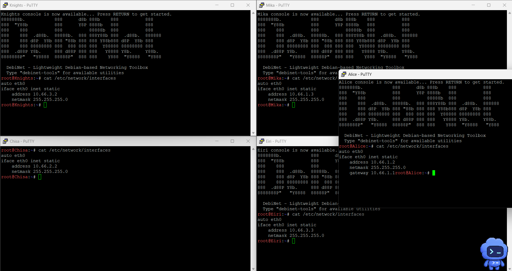

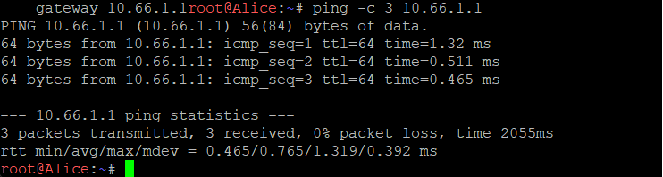

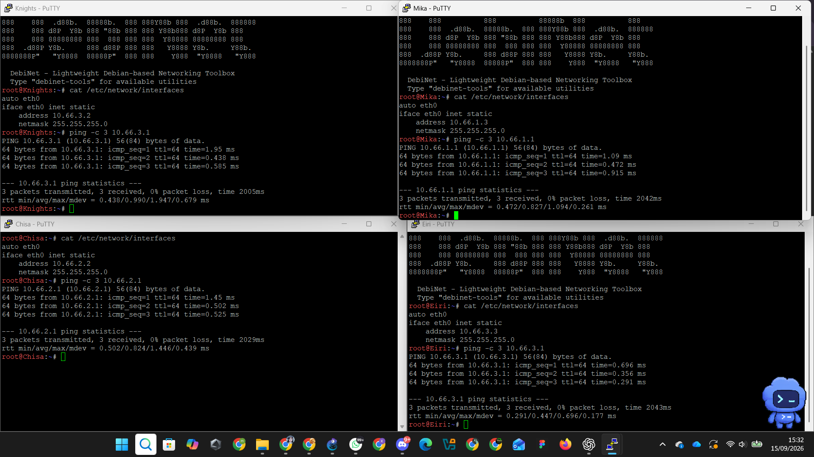


# Nomor 4: NAT MASQUERADE dan DNS untuk Seluruh Client

## Inti Soal

Client harus dapat melakukan ping ke `8.8.8.8` dan membuka/resolve `google.com`.

## Konfigurasi di Lain

Pastikan `iptables` ada:

```bash
command -v iptables
```

Jika pada Lain tidak ada `iptables` dan package manager Alpine tersedia:

```bash
apk add --no-cache iptables
```

Aktifkan forwarding:

```bash
sysctl -w net.ipv4.ip_forward=1
```

Bersihkan rule NAT lama agar tidak duplikat:

```bash
iptables -t nat -F
```

Tambahkan MASQUERADE:

```bash
iptables -t nat -A POSTROUTING -s 10.66.0.0/16 -o eth0 -j MASQUERADE
```

Cek:

```bash
iptables -t nat -L -v -n
```

Ekspektasi akan ada:

```text
MASQUERADE  all  --  10.66.0.0/16  0.0.0.0/0
```

## DNS Seluruh Client

dijalankan pada Alice, Mika, Chisa, Knights, dan Eiri:

```bash
cat > /etc/resolv.conf <<'EOF'
nameserver 1.1.1.1
nameserver 8.8.8.8
EOF
```

### Troubleshooting: DNS belum terset setelah restart

Pada beberapa node, ping ke IP publik seperti `8.8.8.8` berhasil, tetapi ping ke domain seperti `google.com` gagal. Artinya internet sebenarnya sudah jalan, tetapi resolver DNS belum benar.

Error/indikasi:

```bash
ping -c 3 8.8.8.8
ping -c 3 google.com
```

Indikasi error:

```text
ping 8.8.8.8 berhasil
tetapi ping google.com gagal karena domain tidak dapat di-resolve
```

Penyelesaian pada setiap client

## Verifikasi

Pada setiap client:

```bash
ping -c 3 8.8.8.8
ping -c 3 google.com
```

Output benar:

```text
3 packets transmitted, 3 received, 0% packet loss
```

## Screenshot

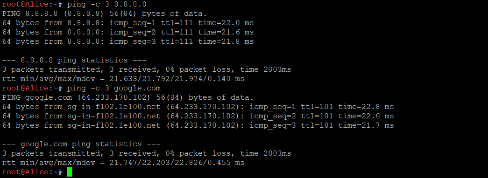

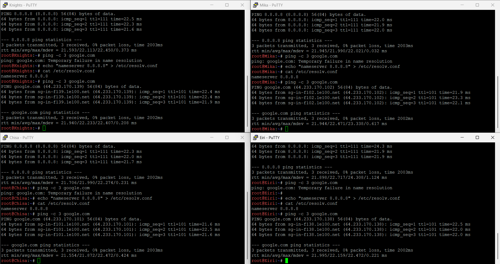


# Nomor 5: Konfigurasi Tetap Dapat Diverifikasi Setelah Restart

## Inti Soal

Setelah restart, konfigurasi jaringan tidak boleh hilang tanpa mekanisme pemulihan. Lain harus mempunyai `/root/cek_status.sh` yang menampilkan interface dan tabel NAT.

## Konfigurasi

```bash
cat > /root/cek_status.sh <<'EOF'
#!/bin/sh

echo "=== INTERFACE SUMMARY ==="
ip -br a 2>/dev/null || ip a

echo
echo "=== ROUTE TABLE ==="
ip route

echo
echo "=== IP FORWARD ==="
sysctl net.ipv4.ip_forward

echo
echo "=== NAT TABLE ==="
iptables -t nat -L -v -n
EOF

chmod +x /root/cek_status.sh
```

Untuk memulihkan forwarding/NAT ketika console root dibuka kembali:

```bash
cat >> /root/.bashrc <<'EOF'

# Restore Protocol 7 routing/NAT
sysctl -w net.ipv4.ip_forward=1 >/dev/null 2>&1
iptables -t nat -C POSTROUTING -s 10.66.0.0/16 -o eth0 -j MASQUERADE 2>/dev/null || \
iptables -t nat -A POSTROUTING -s 10.66.0.0/16 -o eth0 -j MASQUERADE
EOF
```

Konfigurasi IP tetap ditulis pada `/etc/network/interfaces` seperti No.1 dan No.2.

## Verifikasi

Pada Lain:

```bash
/root/cek_status.sh
```

Pada Alice:

```bash
ping -c 3 10.66.2.2
ping -c 3 8.8.8.8
ping -c 3 google.com
```

## Output yang Benar

- eth1 `10.66.1.1/24`
- eth2 `10.66.2.1/24`
- eth3 `10.66.3.1/24`
- `net.ipv4.ip_forward = 1`
- rule MASQUERADE `10.66.0.0/16`
- ping client, internet, dan domain berhasil

## Screenshot

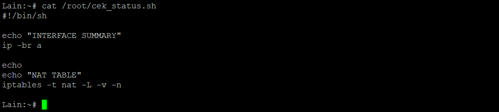

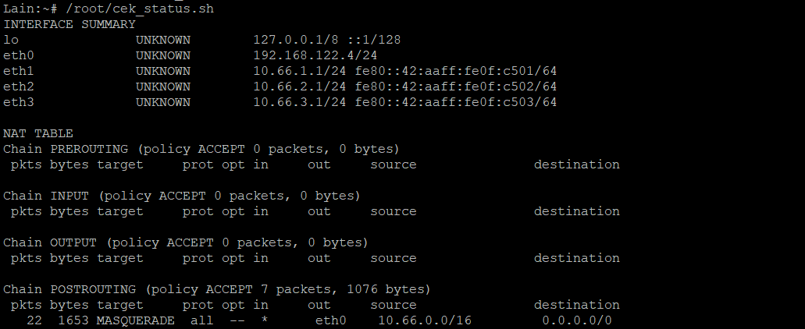

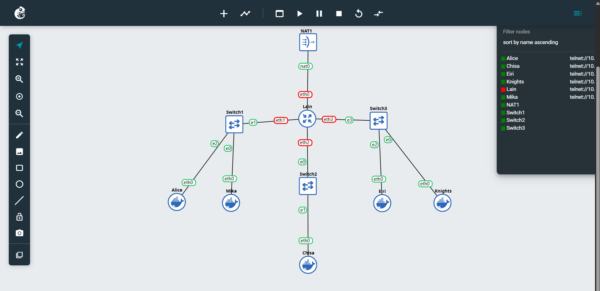

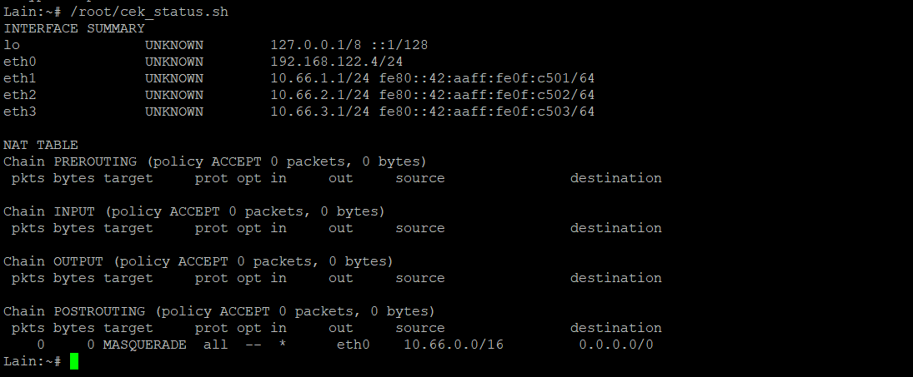

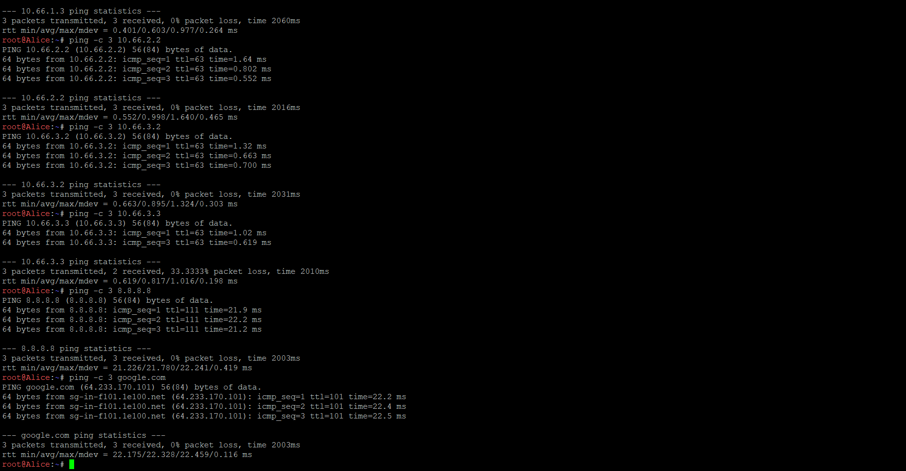


# Nomor 6: Generator Traffic DNS dan ICMP pada Mika

## Inti Soal

Generator traffic yang diberikan soal pada Mika dijalankan, terus dicapture interface Mika menggunakan Wireshark, filter DNS atau ICMP, sama tampilkan ringkasan paket.

## Persiapan isi paket Zip dan File

Pada Mika:

```bash
cat > /etc/resolv.conf <<'EOF'
nameserver 1.1.1.1
nameserver 8.8.8.8
EOF

apt -o Acquire::ForceIPv4=true update
apt -o Acquire::ForceIPv4=true install -y unzip wget
```

Buat folder:

```bash
mkdir -p /root/traffic
cd /root/traffic
```
link soal:

```bash
wget 'https://drive.google.com/drive/folders/1tvZpueSH9E3GWwXM6KNnM64Y5wNoIAYP' -O traffic_protocol7.zip
```

Ekstrak:

```bash
unzip -o traffic_protocol7.zip
ls -lah
```

file yg dikerjakan:

```text
/root/traffic/traffic_protocol7.sh
```

Cek isi:

```bash
sed -n '1,220p' /root/traffic/traffic_protocol7.sh
```

Beri izin:

```bash
chmod +x /root/traffic/traffic_protocol7.sh
```

## Cek Koneksi Sebelum Run

```bash
ping -c 5 8.8.8.8 &
ping -c 5 1.1.1.1 &
ping -c 3 its.ac.id &
```

## Run

```bash
cd /root/traffic
./traffic_protocol7.sh
```

atau:

```bash
bash /root/traffic/traffic_protocol7.sh
```

## Wireshark sblm di run

Display filter:

```wireshark
dns || icmp
```

Ringkasan:

```text
Statistics -> Protocol Hierarchy
```

## Screenshot

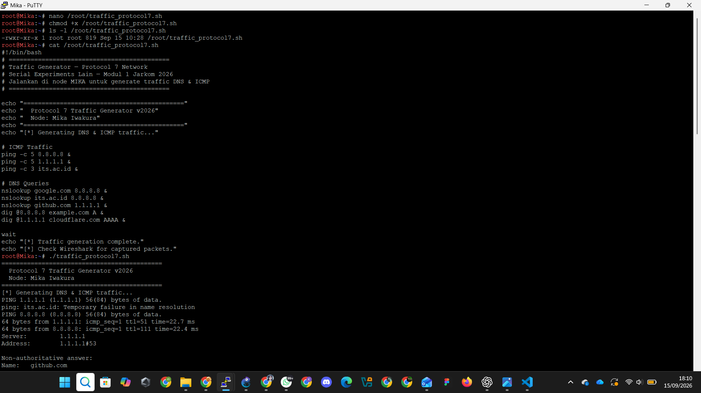
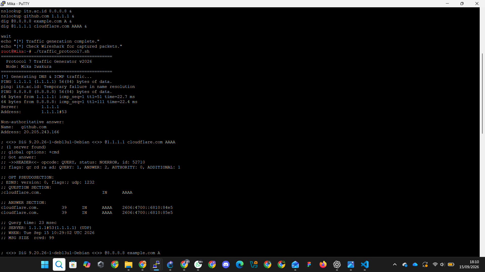
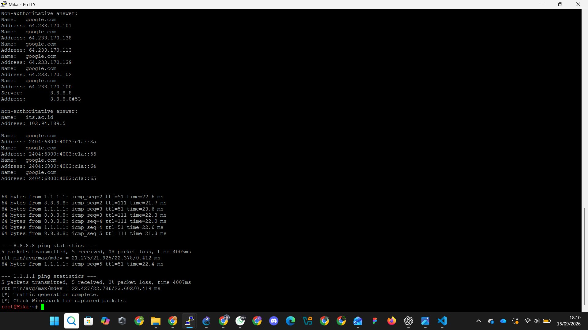
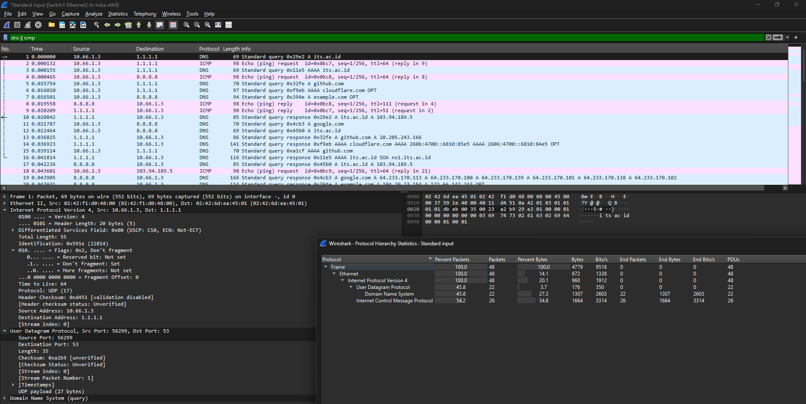

## File Capture

[Buka capture Wireshark Mika](captures/Switch1%20Ethernet%202%20to%20mika%20eth0.pcapng)


# Nomor 7: FTP Server Chisa: Alice RW, Mika Read-Only, Eiri Blacklist

## Inti Soal

Shared folder:

```text
/var/wired/data
```

Hak:

```text
alice = read/write
mika  = read-only
eiri  = blacklist
```

## Chisa

Perbaiki DNS:

```bash
cat > /etc/resolv.conf <<'EOF'
nameserver 1.1.1.1
nameserver 8.8.8.8
EOF
```

Install vsftpd:

```bash
apt -o Acquire::ForceIPv4=true update
apt -o Acquire::ForceIPv4=true install --no-install-recommends -y vsftpd
```

Cek:

```bash
which vsftpd
```

Buat user:

```bash
useradd -m -s /bin/bash alice 2>/dev/null || true
useradd -m -s /bin/bash mika 2>/dev/null || true
useradd -m -s /bin/bash eiri 2>/dev/null || true

echo 'alice:123' | chpasswd
echo 'mika:mika123' | chpasswd
echo 'eiri:eiri123' | chpasswd
```

Cek:

```bash
grep -E '^(alice|mika|eiri):' /etc/passwd
```

Shared folder:

```bash
mkdir -p /var/wired/data
chown alice:alice /var/wired/data
chmod 755 /var/wired/data
ls -ld /var/wired/data
```

Blacklist Eiri:

```bash
echo 'eiri' > /etc/vsftpd.userlist
cat /etc/vsftpd.userlist
```

Konfigurasi vsftpd:

```bash
cat > /etc/vsftpd.conf <<'EOF'
listen=YES
listen_ipv6=NO

anonymous_enable=NO
local_enable=YES
write_enable=YES
local_umask=022

chroot_local_user=YES
allow_writeable_chroot=YES
local_root=/var/wired/data

userlist_enable=YES
userlist_deny=YES
userlist_file=/etc/vsftpd.userlist

pasv_enable=YES
pasv_min_port=40000
pasv_max_port=40010
EOF
```

Start:

```bash
pkill vsftpd 2>/dev/null || true
/usr/sbin/vsftpd /etc/vsftpd.conf &
sleep 1
ss -lntp | grep ':21'
```

Ekspektasi port 21 `LISTEN`.

## Install FTP Client

Pada Alice:

```bash
apt -o Acquire::ForceIPv4=true update
apt -o Acquire::ForceIPv4=true install -y ftp
```

Pada Mika:

```bash
apt -o Acquire::ForceIPv4=true update
apt -o Acquire::ForceIPv4=true install -y ftp
```

Pada Eiri:

```bash
apt -o Acquire::ForceIPv4=true update
apt -o Acquire::ForceIPv4=true install -y ftp
```

Jika package `ftp` tidak tersedia:

```bash
apt -o Acquire::ForceIPv4=true install -y inetutils-ftp
```

## Uji Alice

```bash
echo 'signal from alice' > /root/signal_alice.txt
cd /root
ftp 10.66.2.2
```

Login:

```text
Name: alice
Password: 123
```

Di FTP:

```ftp
binary
put signal_alice.txt
ls
bye
```

Ekspektasi:

```text
230 Login successful.
150 ...
226 Transfer complete.
```

Verifikasi Chisa:

```bash
ls -lh /var/wired/data
cat /var/wired/data/signal_alice.txt
```

## Uji Mika

```bash
echo 'test upload mika' > /root/test_mika.txt
ftp 10.66.2.2
```

Login `mika` / `mika123`, lalu:

```ftp
ls
get signal_alice.txt
put /root/test_mika.txt test_mika.txt
bye
```

Read/get harus berhasil, write ditolak

## Uji Eiri

```bash
ftp 10.66.2.2
```

Login sebagai `eiri` harus ditolak.

## Screenshot

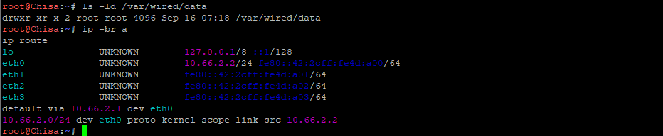
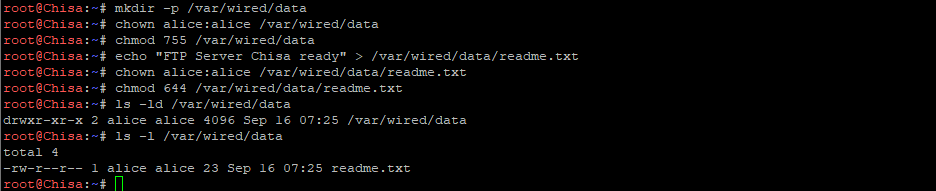
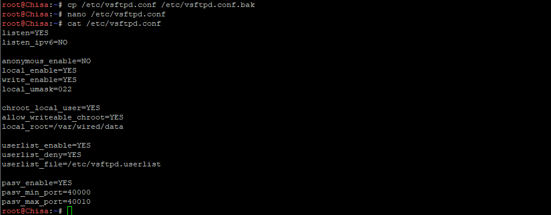
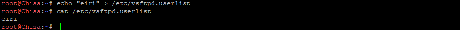
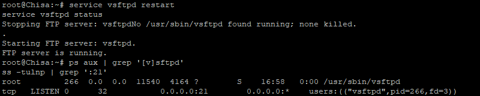
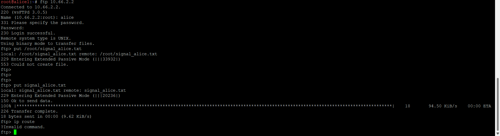
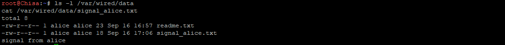
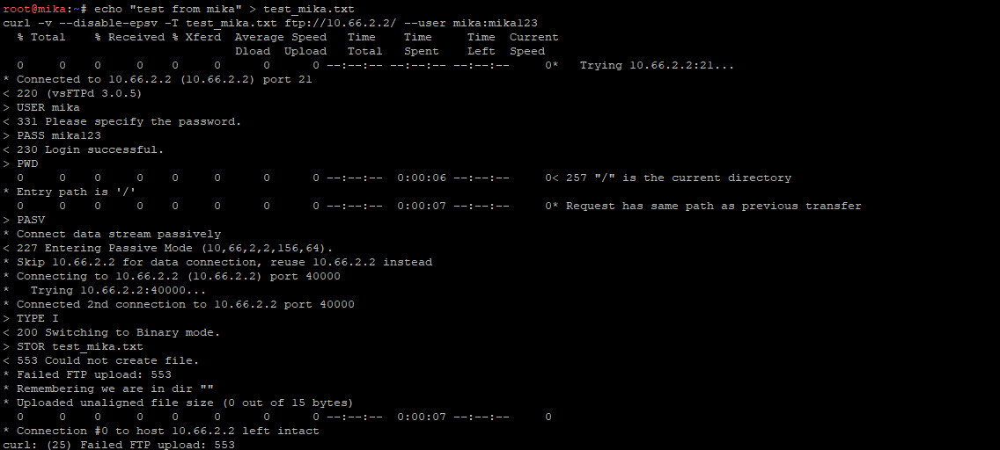
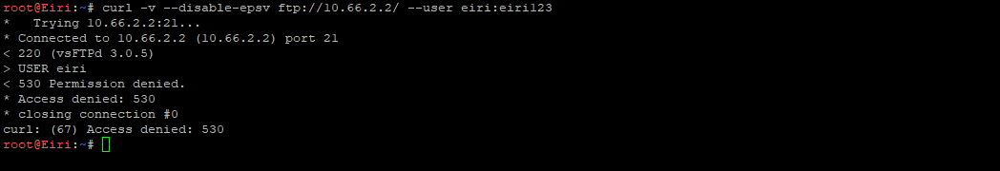

---

# Nomor 8: Knights Upload `knights_report.zip` ke FTP Chisa

## Knights

FTP client harus gini:

```bash
cat > /etc/resolv.conf <<'EOF'
nameserver 1.1.1.1
nameserver 8.8.8.8
EOF

apt -o Acquire::ForceIPv4=true update
apt -o Acquire::ForceIPv4=true install -y ftp wget
```

File:

```bash
mkdir -p /root/8
```

Cek:

```bash
ls -lh /root/8/knights_report.zip
```

pas dirun ukurannya:

```text
772 bytes
```

## Cek Koneksi

```bash
ping -c 3 10.66.3.1
ping -c 3 10.66.2.2
```

## Upload Manual

```bash
cd /root/8
ftp -p 10.66.2.2
```

Login:

```text
Name: alice
Password: 123
```

FTP:

```ftp
binary
put knights_report.zip
ls
bye
```

## Temuan

```text
Upload command : STOR knights_report.zip
Success code   : 226 Transfer complete
Passive mode   : EPSV / response 229
Data TCP port  : 40008
```

## Wireshark

```wireshark
ftp
```


```wireshark
ftp.request.command == "STOR"
```

```wireshark
ftp.response.code == 226
```

```wireshark
ftp.response.code == 229 || ftp.response.code == 227
```

## Capture

[Buka capture Wireshark Knights](captures/Switch3_Ethernet2_to_knights_eth0.pcapng)

## Screenshot

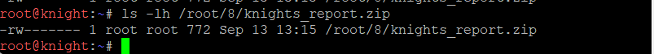

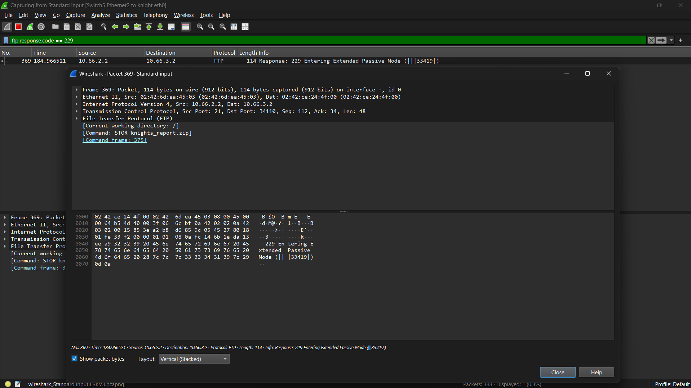

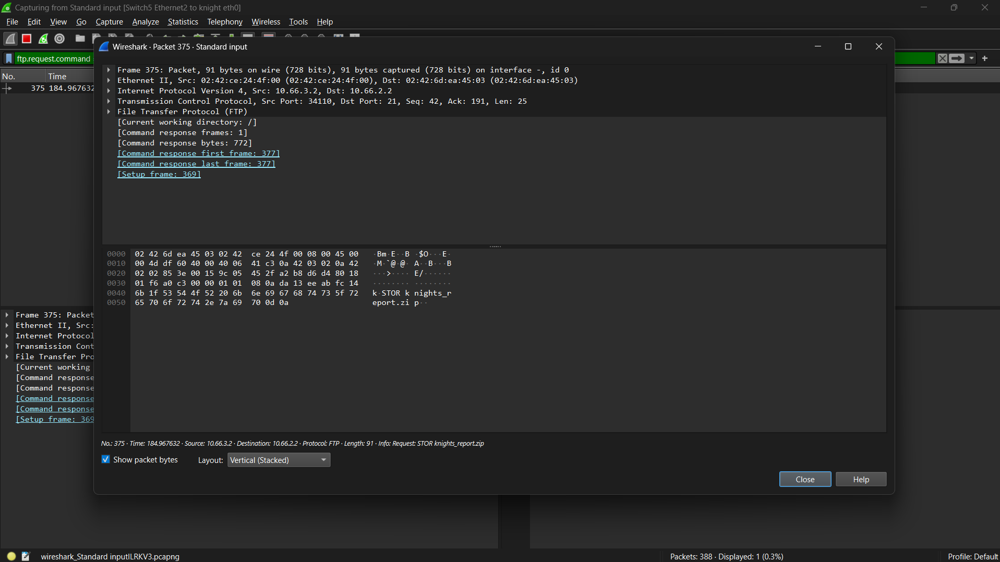

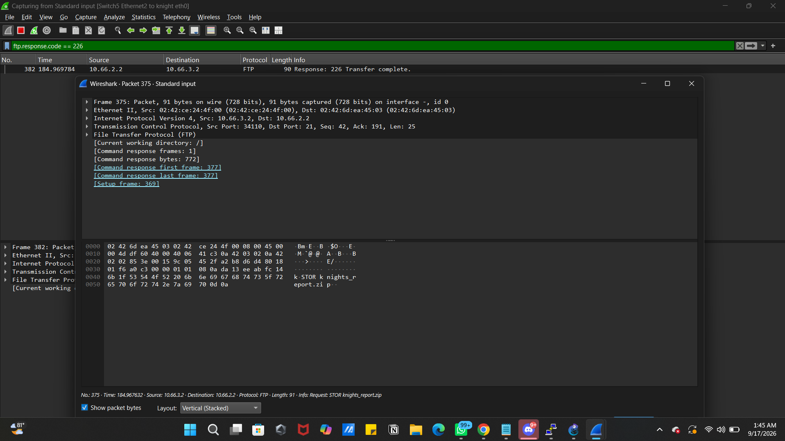

---

# Nomor 9: Mika Download Dokumen dan Buktikan Read-Only

## Run

Mika:

```bash
apt -o Acquire::ForceIPv4=true update
apt -o Acquire::ForceIPv4=true install -y ftp
```

file buat nguji upload:

```bash
echo 'test upload mika' > /root/test_mika.txt
```

## Cek Koneksi

```bash
ping -c 3 10.66.2.2
```

## Login FTP

```bash
cd /root
ftp 10.66.2.2
```

Login:

```text
Name: mika
Password: mika123
```

Di FTP:

```ftp
ls
get <NAMA_DOKUMEN_NO9_DARI_SOAL>
put test_mika.txt
bye
```

## Output

Download:

```text
150 ...
226 Transfer complete.
```

Upload read-only ditolak

```text
550 Permission denied
```

Server mengembalikan:

```text
553 Could not create file.
```

Artinya pembatasan write bekerja

## Screenshot

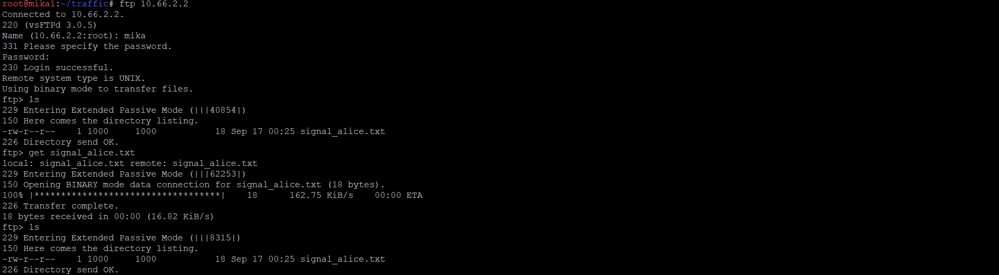

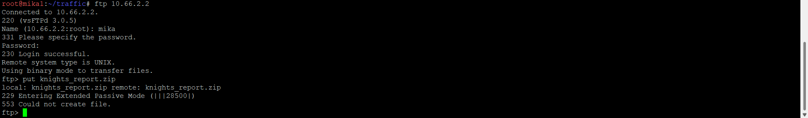

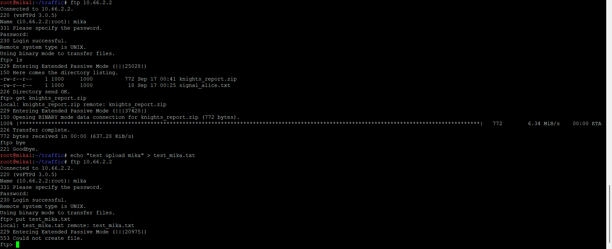


---

# Nomor 10: Ping 77 Paket Knights ke Chisa

## Cek Awal

Knights:

```bash
ping -c 3 10.66.2.2
```

## Buka wireshark Run

```bash
ping -c 77 -s 128 -i 0.3 10.66.2.2
```

## Output yang Benar

```text
77 packets transmitted, 77 received, 0% packet loss
rtt min/avg/max/mdev = .../.../.../... ms
```

## Wireshark

```wireshark
icmp
```

Echo Request:

```text
Source      : 10.66.3.2
Destination : 10.66.2.2
Type        : 8
Code        : 0
```

Echo Reply:

```text
Source      : 10.66.2.2
Destination : 10.66.3.2
Type        : 0
Code        : 0
```

Tanpa loss packet hrsnya:

```text
77 request + 77 reply = 154 ICMP packets
```

## Screenshot

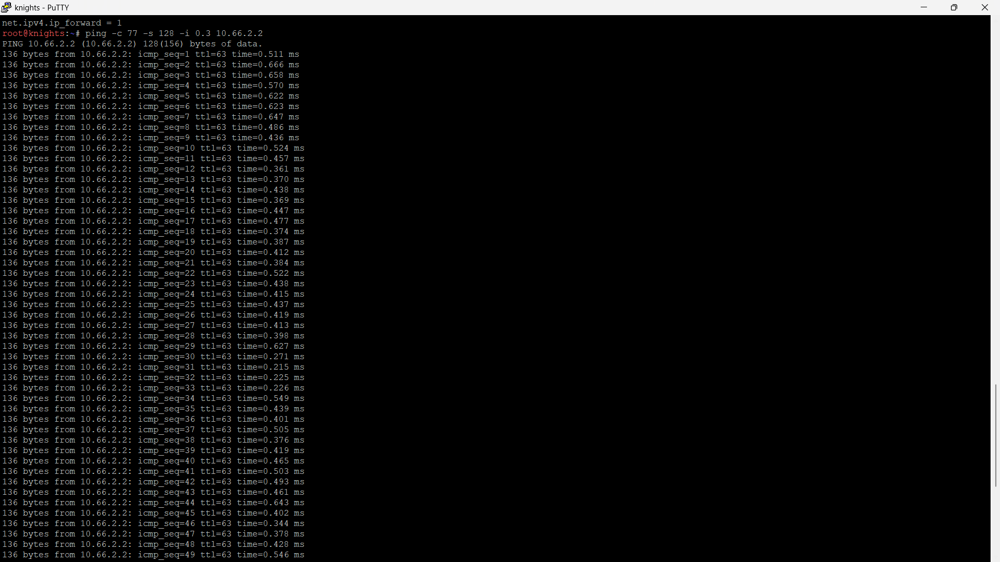

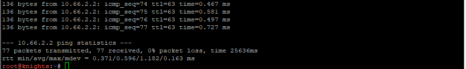

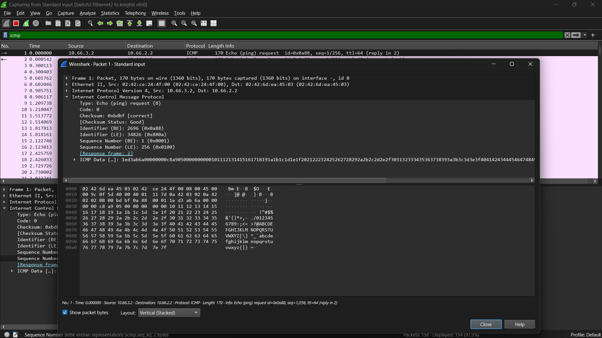

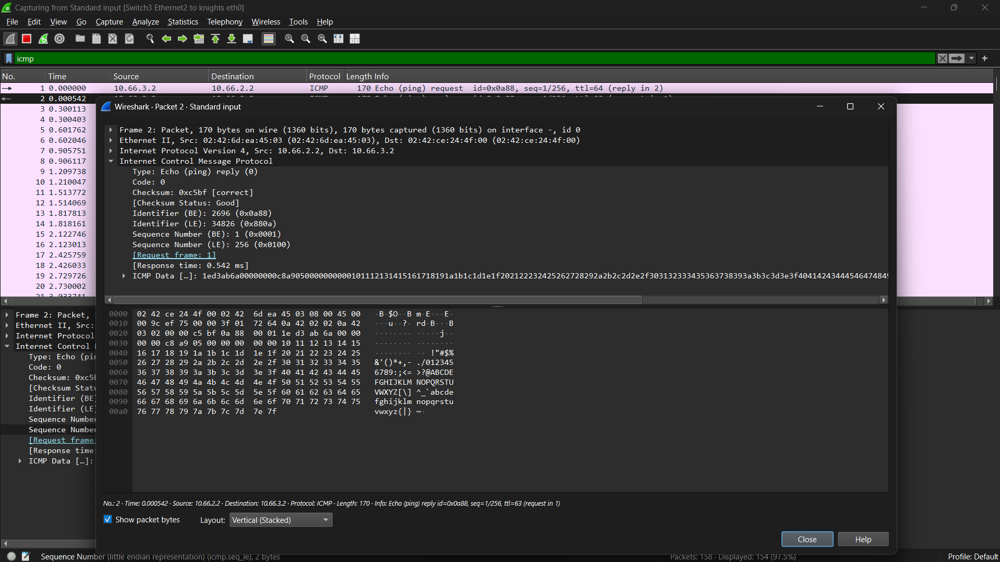

# Nomor 11: Telnet Chisa dan Plaintext Credential

## Setup Chisa

```bash
cat > /etc/resolv.conf <<'EOF'
nameserver 1.1.1.1
nameserver 8.8.8.8
EOF
```

Install:

```bash
apt -o Acquire::ForceIPv4=true update
apt -o Acquire::ForceIPv4=true install -y openbsd-inetd telnetd telnet
```

Buat user:

```bash
useradd -m -s /bin/bash phantom_user 2>/dev/null || true
echo 'phantom_user:wired_ghost' | chpasswd
```

inetd:

```bash
cat > /etc/inetd.conf <<'EOF'
telnet stream tcp nowait root /usr/sbin/telnetd telnetd
EOF
```

Restart inetd manual:

```bash
pkill inetd 2>/dev/null || true
/usr/sbin/inetd
sleep 1
```

Cek:

```bash
grep '^phantom_user:' /etc/passwd
cat /etc/inetd.conf
ss -lntp | grep ':23'
```

## Setup Eiri

Pastikan telnet client:

```bash
apt -o Acquire::ForceIPv4=true update
apt -o Acquire::ForceIPv4=true install -y telnet
```

kalo package `telnet` tidak tersedia:

```bash
apt -o Acquire::ForceIPv4=true install -y inetutils-telnet
```

## Wireshark dan Login

Pada Eiri:

```bash
telnet 10.66.2.2
```

Masukkan:

```text
login: phantom_user
Password: wired_ghost
```

Sesudah masuk:

```bash
whoami
```

Ekspektasi:

```text
phantom_user
```

Keluar:

```bash
exit
```

## Wireshark

```wireshark
telnet || tcp.port == 23
```

Klik packet Telnet:

```text
Right Click -> Follow -> TCP Stream
```

## Analisis

Telnet tidak mengenkripsi sesi. Input terminal dikirim di atas TCP secara terbuka. Karena mode terminal interaktif dapat segera mengirim karakter yang diketik, karakter dapat terlihat pada segmen TCP kecil/terpisah dan dapat direkonstruksi pada Follow TCP Stream.

## Screenshot

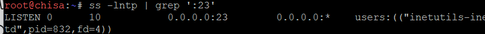

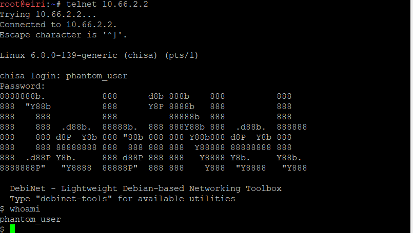

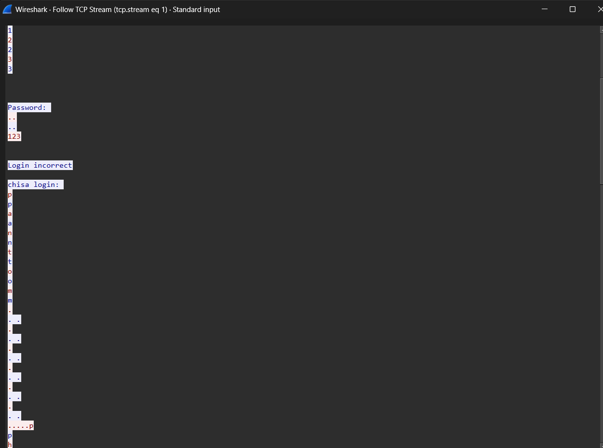

---

# Nomor 12: Netcat Scan Alice ke Knights

## Setup Knights

```bash
cat > /etc/resolv.conf <<'EOF'
nameserver 1.1.1.1
nameserver 8.8.8.8
EOF

apt -o Acquire::ForceIPv4=true update
apt -o Acquire::ForceIPv4=true install -y openssh-server netcat-openbsd
```

Start SSH port 22:

```bash
mkdir -p /run/sshd
ssh-keygen -A
pkill sshd 2>/dev/null || true
/usr/sbin/sshd
```

port HTTP 80 pakai netcat listener

```bash
pkill -f 'nc.*80' 2>/dev/null || true
nohup sh -c 'while true; do printf "HTTP/1.1 200 OK\r\nContent-Length: 13\r\n\r\nKnights HTTP\n" | nc -l -p 80; done' >/tmp/knights_http.log 2>&1 &
```

7777 tidak ada listener:

```bash
ss -lntp | grep -E ':22|:80|:7777' || true
```

Harusnya:

```text
22 LISTEN
80 LISTEN
7777 tidak LISTEN
```

## Setup Alice

```bash
apt -o Acquire::ForceIPv4=true update
apt -o Acquire::ForceIPv4=true install -y netcat-openbsd
```

## Cek Koneksi

```bash
ping -c 3 10.66.3.2
```

## Wireshark Scan

```bash
nc -vz -w 2 10.66.3.2 22 || true
nc -vz -w 2 10.66.3.2 80 || true
nc -vz -w 2 10.66.3.2 7777 || true
```

Ekspektasi:

```text
22   succeeded/open
80   succeeded/open
7777 Connection refused/closed
```

## Wireshark

```wireshark
tcp.port == 22 || tcp.port == 80 || tcp.port == 7777
```

Port open:

```text
SYN -> SYN,ACK
```

Port closed:

```text
SYN -> RST,ACK
```

## Screenshot

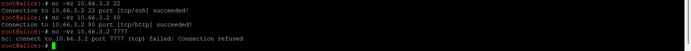


---

# Nomor 13: SSH Passwordless Mika ke Knights

## Setup Mika

Install SSH client:

```bash
cat > /etc/resolv.conf <<'EOF'
nameserver 1.1.1.1
nameserver 8.8.8.8
EOF

apt -o Acquire::ForceIPv4=true update
apt -o Acquire::ForceIPv4=true install -y openssh-client
```

Buat user:

```bash
useradd -m -s /bin/bash mika_admin 2>/dev/null || true
```

Buat `.ssh`:

```bash
mkdir -p /home/mika_admin/.ssh
chown -R mika_admin:mika_admin /home/mika_admin/.ssh
chmod 700 /home/mika_admin/.ssh
```

Generate key:

```bash
su - mika_admin -c 'ssh-keygen -t ed25519 -N "" -f /home/mika_admin/.ssh/id_ed25519'
```

Lihat public key:

```bash
cat /home/mika_admin/.ssh/id_ed2******.pub
```

## Setup Knights

Install SSH server:

```bash
cat > /etc/resolv.conf <<'EOF'
nameserver 1.1.1.1
nameserver 8.8.8.8
EOF

apt -o Acquire::ForceIPv4=true update
apt -o Acquire::ForceIPv4=true install -y openssh-server
```

Buat user:

```bash
useradd -m -s /bin/bash mika_admin 2>/dev/null || true
```

Copy public key Mika secara manual. Pada Knights:

```bash
cat > /root/mika_admin.pub <<'EOF'
<PASTE_PUBLIC_KEY_DARI_MIKA_DI_SINI>
EOF
```

Pastikan isinya diawali `ssh-ed25519`:

```bash
cat /root/mika_admin.pub
```

Pasang authorized key:

```bash
mkdir -p /home/mika_admin/.ssh
cat /root/mika_admin.pub > /home/mika_admin/.ssh/authorized_keys

chown -R mika_admin:mika_admin /home/mika_admin
chmod 755 /home/mika_admin
chmod 700 /home/mika_admin/.ssh
chmod 600 /home/mika_admin/.ssh/authorized_keys
```

Pastikan host key ada:

```bash
mkdir -p /run/sshd
ssh-keygen -A
```

Atur sshd:

```bash
sed -i -E 's/^[#[:space:]]*PasswordAuthentication[[:space:]].*/PasswordAuthentication no/' /etc/ssh/sshd_config
sed -i -E 's/^[#[:space:]]*PubkeyAuthentication[[:space:]].*/PubkeyAuthentication yes/' /etc/ssh/sshd_config
sed -i -E 's/^[#[:space:]]*PermitRootLogin[[:space:]].*/PermitRootLogin no/' /etc/ssh/sshd_config
sed -i -E 's#^[#[:space:]]*AuthorizedKeysFile[[:space:]].*#AuthorizedKeysFile .ssh/authorized_keys#' /etc/ssh/sshd_config
```

Jika salah satu directive belum ada sama sekali:

```bash
grep -q '^PasswordAuthentication no' /etc/ssh/sshd_config || echo 'PasswordAuthentication no' >> /etc/ssh/sshd_config
grep -q '^PubkeyAuthentication yes' /etc/ssh/sshd_config || echo 'PubkeyAuthentication yes' >> /etc/ssh/sshd_config
grep -q '^PermitRootLogin no' /etc/ssh/sshd_config || echo 'PermitRootLogin no' >> /etc/ssh/sshd_config
grep -q '^AuthorizedKeysFile .ssh/authorized_keys' /etc/ssh/sshd_config || echo 'AuthorizedKeysFile .ssh/authorized_keys' >> /etc/ssh/sshd_config
```

Restart:

```bash
pkill sshd 2>/dev/null || true
/usr/sbin/sshd
```

Cek:

```bash
grep -E '^(PasswordAuthentication|PubkeyAuthentication|PermitRootLogin|AuthorizedKeysFile)' /etc/ssh/sshd_config
ls -ld /home/mika_admin
ls -ld /home/mika_admin/.ssh
ls -l /home/mika_admin/.ssh/authorized_keys
ss -lntp | grep ':22'
```

## Wireshark

sblm login

```text
GNS3 -> Mika eth0 <-> Switch1 -> Start Capture
```

## Login Mika

```bash
su - mika_admin -c 'ssh -i /home/mika_admin/.ssh/id_ed25519 -o StrictHostKeyChecking=no -o PreferredAuthentications=publickey -o PasswordAuthentication=no mika_admin@10.66.3.2 "whoami; hostname"'
```

Output final yang sudah didapat:

```text
mika_admin
knights
```

Tidak ada prompt password.

## Wireshark

```wireshark
ssh || tcp.port == 22
```

Cari:

```text
Protocol Version Exchange
Key Exchange Init
Encrypted packet
```

## Analisis

SSH melakukan key exchange dan membentuk channel terenkripsi. Autentikasi public key tidak mengirim password plaintext seperti Telnet.

## Screenshot

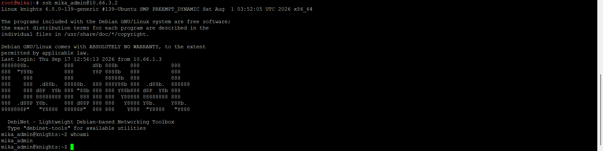

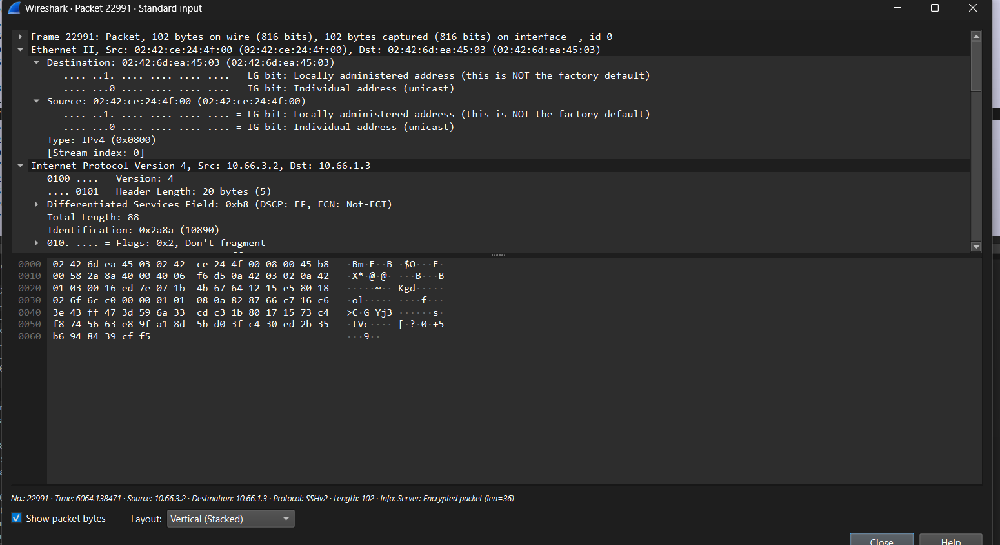

# Nomor 14: Analisis HTTP Brute Force

## File Input

```text
wired_bruteforce.pcapng
```

## Langkah Wireshark

Filter semua POST:

```wireshark
http.request.method == "POST"
```

Cari request `/login.php`.

Dari bukti laporan:

```text
Attacker : 172.26.7.50
Target   : 172.26.7.100
Port     : 8080
Endpoint : POST /login.php
```

Lihat gagal:

```wireshark
http.response.code == 401
```

Cari response yang bukan gagal:

```wireshark
http.response && http.response.code != 401
```

Klik request/response sukses:

```text
Right Click -> Follow -> TCP Stream
```

Cari field login user:

```text
lain_admin
```

Password final harus diambil dari stream sukses yang sama.

Cari server header:

```wireshark
http.server
```

atau:

```wireshark
http.response
```

Server software/version final harus berasal dari response sukses yang sama.

## Validasi Socket

Ip socket grup

## Hasil

```text
Attacker IP : 172.26.7.50
Target IP   : 172.26.7.100
Target port : 8080
Endpoint    : /login.php
```

Untuk:

```text
Password lain_admin
Web server software/version
```

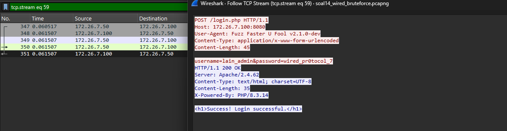

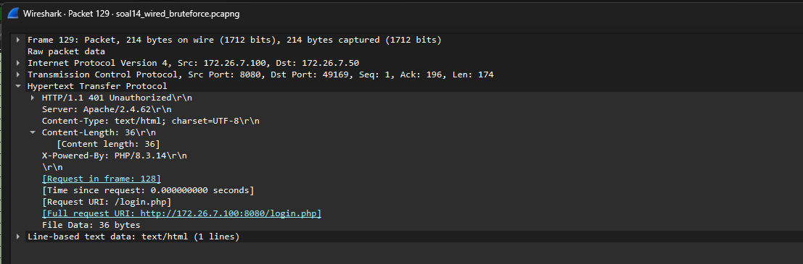


## Screenshot

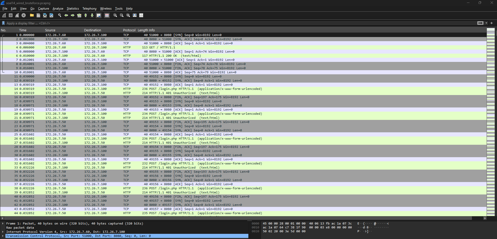

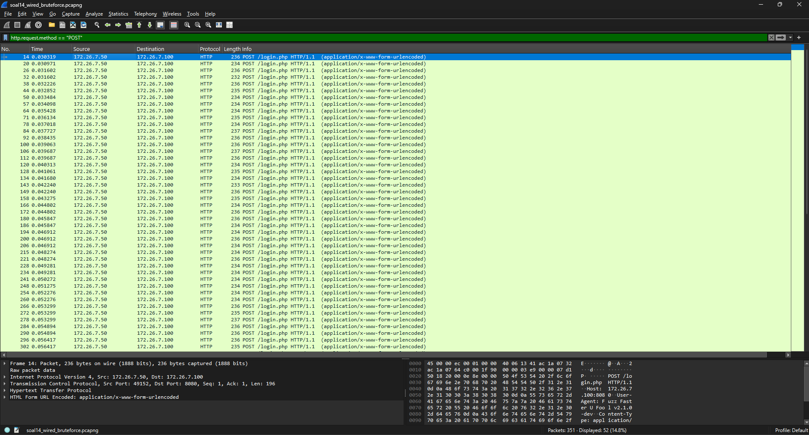

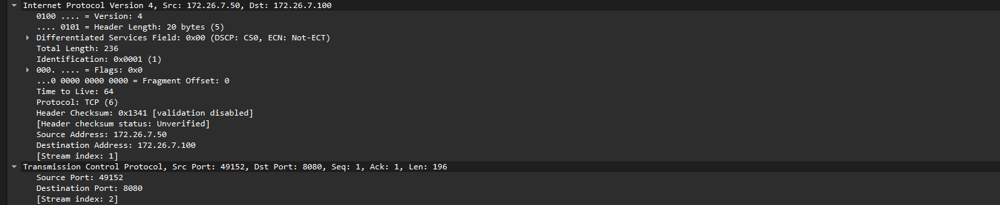

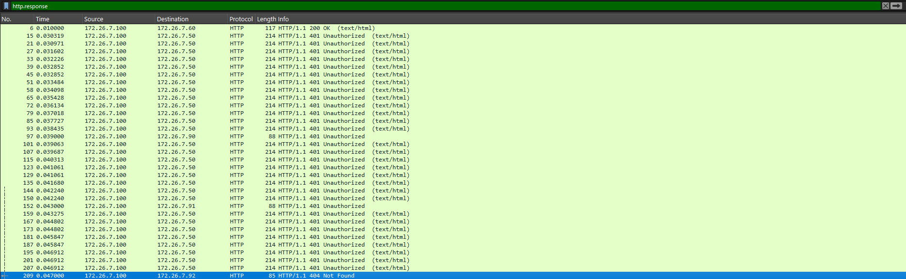


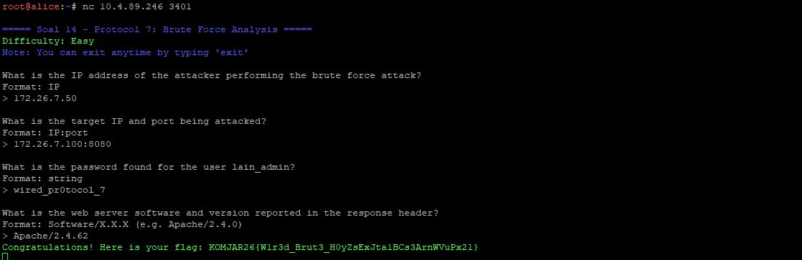

---

# Nomor 15: Analisis USB HID Keyboard

## File Input

```text
wired_usb_hid.pcap
```

## Wireshark

Filter interrupt transfer:

```wireshark
usb.transfer_type == 0x01
```

Fokus pada `usb.capdata` yang tidak semuanya nol.

## Ekstraksi Tshark di Windows

```cmd
"C:\Program Files\Wireshark\tshark.exe" -r wired_usb_hid.pcap -Y "usb.transfer_type == 0x01 && usb.capdata != 00:00:00:00:00:00:00:00" -T fields -e frame.number -e usb.capdata > hid_data.txt
type hid_data.txt
```

## Decode

Hasil yang sudah diperoleh:

```text
Vendor ID      : 0x046d
Product ID     : 0xc31c
Device Address : 7
Device          : Logitech Keyboard K120
Secret Message  : Wired_Protocol_7_is_alive_2026
```

`15_decode_hid.py`:

```python
hid_map = {
    0x04:'a',0x05:'b',0x06:'c',0x07:'d',0x08:'e',0x09:'f',
    0x0a:'g',0x0b:'h',0x0c:'i',0x0d:'j',0x0e:'k',0x0f:'l',
    0x10:'m',0x11:'n',0x12:'o',0x13:'p',0x14:'q',0x15:'r',
    0x16:'s',0x17:'t',0x18:'u',0x19:'v',0x1a:'w',0x1b:'x',
    0x1c:'y',0x1d:'z',
    0x1e:'1',0x1f:'2',0x20:'3',0x21:'4',0x22:'5',
    0x23:'6',0x24:'7',0x25:'8',0x26:'9',0x27:'0',
    0x2c:' ',0x2d:'-'
}

shift_map = {
    '1':'!','2':'@','3':'#','4':'$','5':'%','6':'^',
    '7':'&','8':'*','9':'(','0':')','-':'_'
}

records = []

with open("hid_data.txt", "r", encoding="utf-8") as f:
    for line in f:
        parts = line.strip().split()
        if not parts:
            continue

        cap = parts[-1].replace(":", "")
        if len(cap) < 16:
            continue

        raw = bytes.fromhex(cap)
        modifier = raw[0]
        keycode = raw[2]

        if keycode != 0:
            records.append((modifier, keycode))

out = []

for mod, key in records:
    ch = hid_map.get(key, '')
    if not ch:
        continue

    shifted = bool(mod & 0x02)
    if shifted:
        if ch.isalpha():
            ch = ch.upper()
        else:
            ch = shift_map.get(ch, ch)

    out.append(ch)

print("Secret Message:")
print("".join(out))
```

Run:

```cmd
python 15_decode_hid.py
```

## Validasi

```bash
nc 10.4.89.246 3402
```

## Screenshot

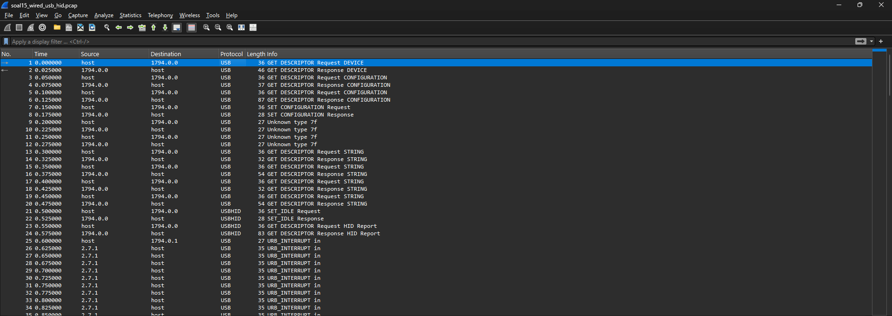

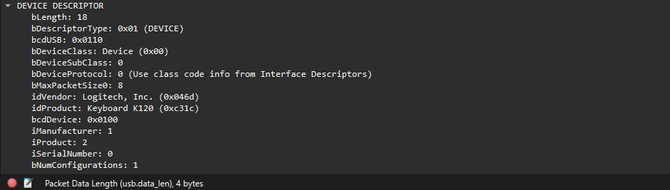

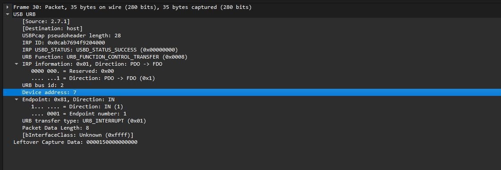

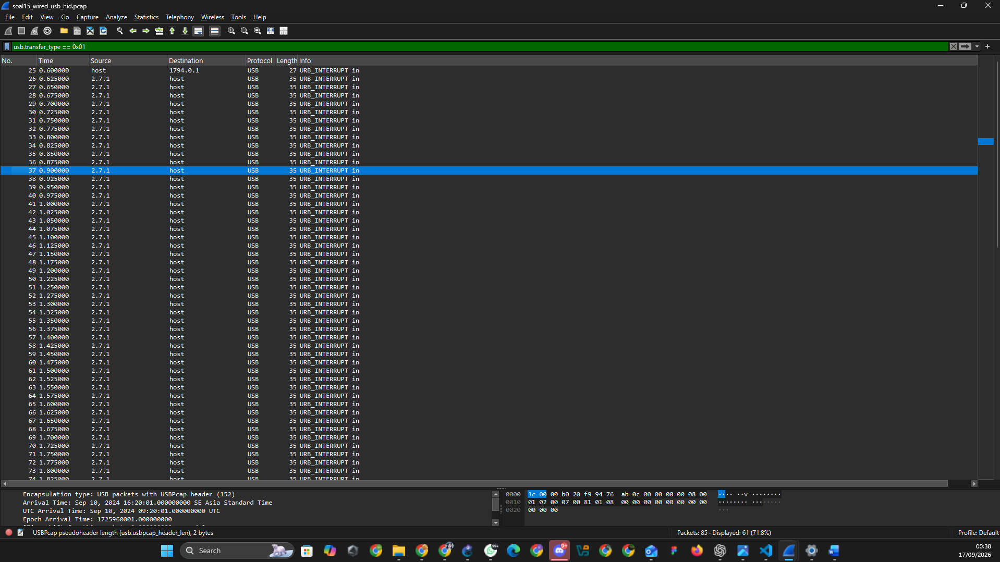

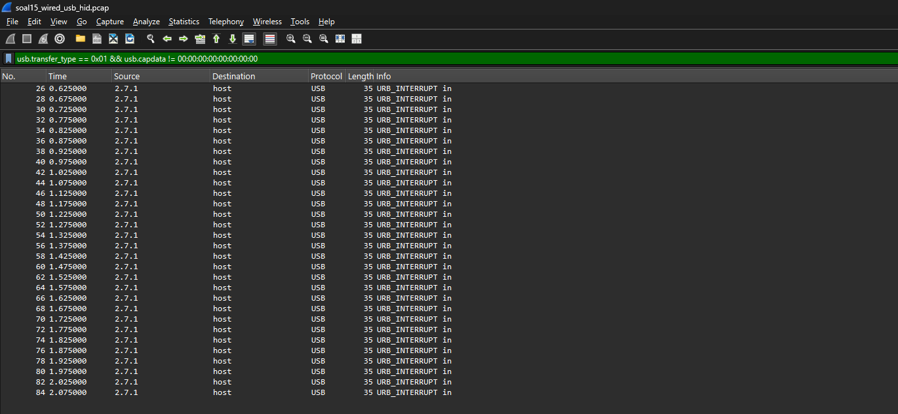

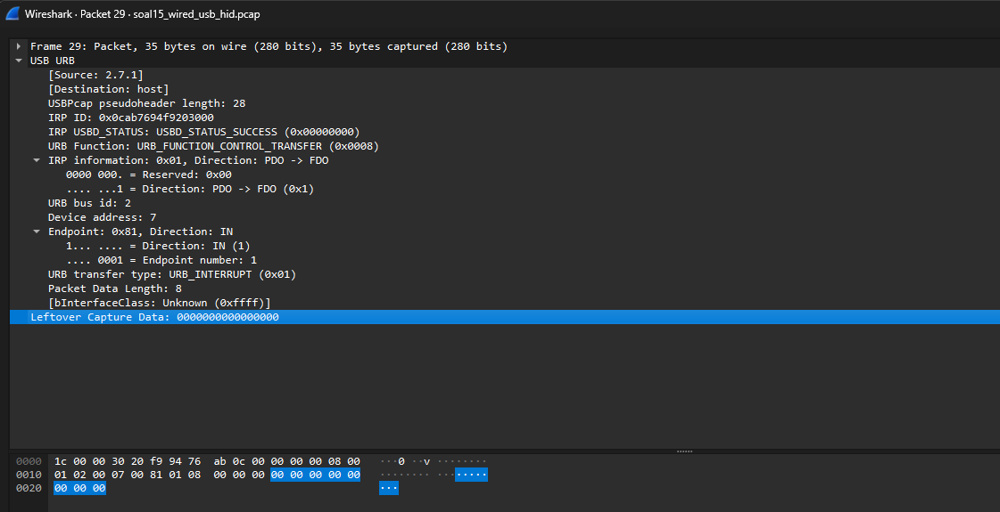

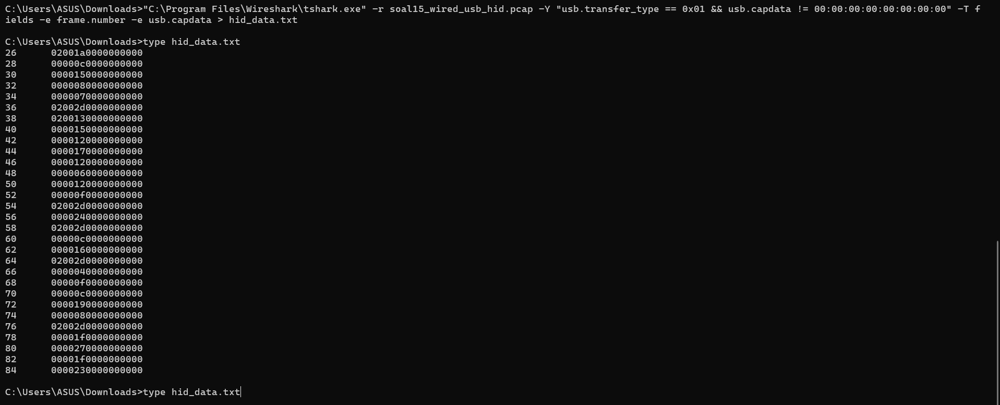

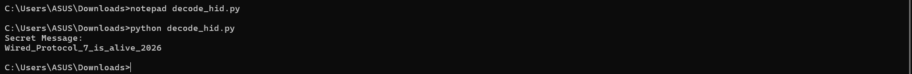

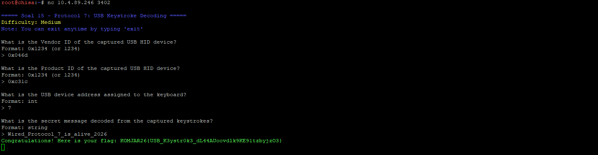

---

# Nomor 16: Analisis FTP Theft

## File Input

```text
wired_ftp_theft.pcap
```

## Wireshark

```wireshark
ftp
```

banner:

```text
220 Welcome to Wired FTP Server (vsftpd 3.0.5)
```

login:

```text
USER knights_agent
PASS N4v1_s3cur3_2026
230 Login successful
```

file: 

```text
SIZE knights_payload.exe
213 524288
RETR knights_payload.exe
150 Opening BINARY mode data connection ... (524288 bytes)
226 Transfer complete
```

## Hasil

```text
FTP Server IP : 198.51.100.7
FTP Banner    : vsftpd 3.0.5
Credential    : knights_agent:N4v1_s3cur3_2026
File          : knights_payload.exe
File size     : 524288 bytes
```

## Validasi

```bash
nc 10.4.89.246 3403
```

Flag yang sudah tercatat pada laporan:

```text
KOMJAR26{FTP_Th3ft_qD5Dtocvo9lO5rGC3Gip2kohC}
```

## Screenshot

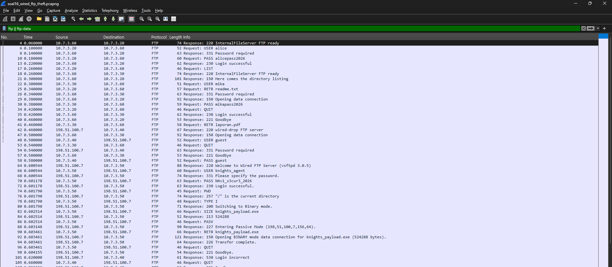


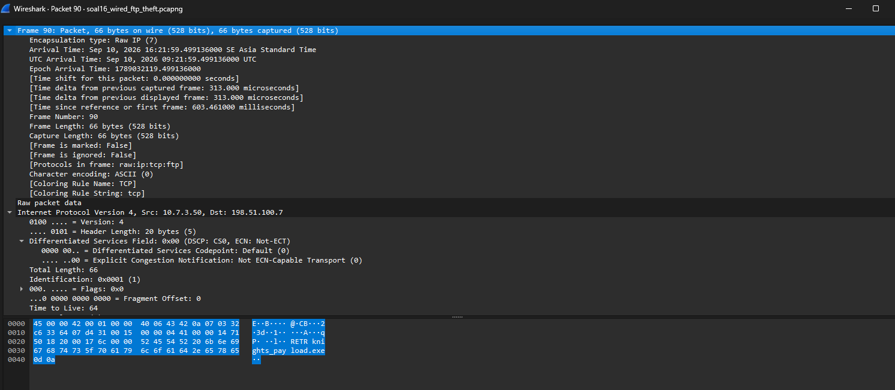

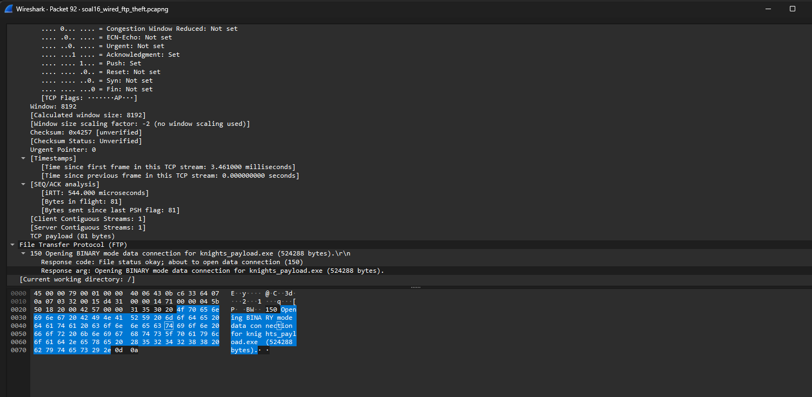

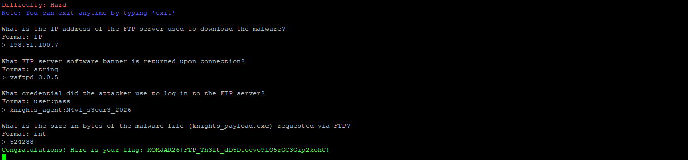

---

# Nomor 17: Analisis HTTP C2 / Malware Download

## File Input

```text
wired_http_c2.pcap
```

atau `.pcapng` sesuai file soal yang diterima.

## Wireshark

Request:

```wireshark
http.request
```

Temuan:

```text
10.7.1.50 -> 203.0.113.42
GET /navi_agent.exe HTTP/1.1
Host: wired-update.net
```

Untuk khusus executable:

```wireshark
http.request.uri contains ".exe"
```

Response:

```wireshark
http.response
```

Hasil:

```text
HTTP/1.1 200 OK
Server: nginx/1.24.0
Content-Type: application/octet-stream
Content-Length: 396
Content-Disposition: attachment; filename="navi_agent.exe"
```

## Hasil

```text
Host domain        : wired-update.net
IP server attacker : 203.0.113.42
File malware       : navi_agent.exe
HTTP status code   : 200
```

## Validasi

```bash
nc 10.4.89.246 3404
```

Input:

```text
wired-update.net
203.0.113.42
navi_agent.exe
200
```

## Screenshot

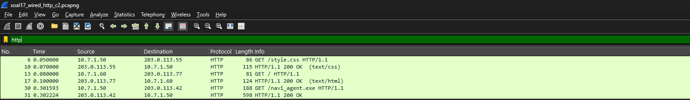


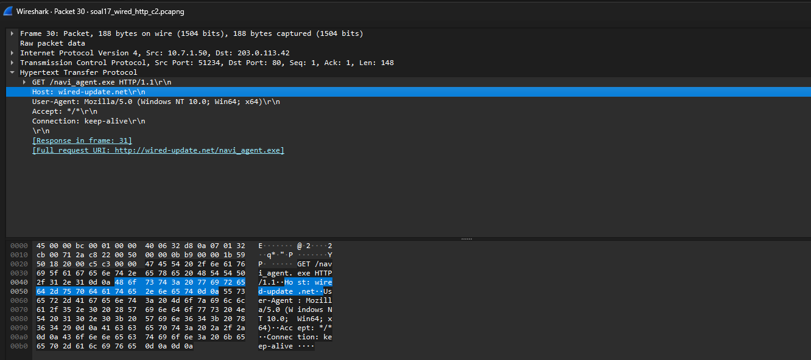

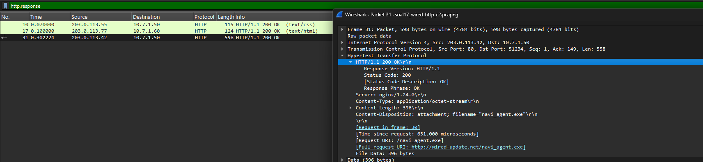

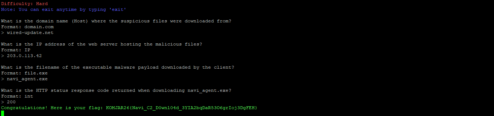

---

# Nomor 18: Analisis SMB Malware Transfer

## File Input

```text
wired_smb_transfer.pcapng
```

## Wireshark

Filter awal:

```wireshark
smb || smb2
```

Cari executable:

```wireshark
smb2.filename contains ".exe"
```

Temuan:

```text
10.7.3.100 -> 10.7.1.50
Create Request, File: System32\wired_trojan_payload.exe
Write Request, File: System32\wired_trojan_payload.exe
```

## Hasil

```text
Protocol exploited : SMB2
Source host IP      : 10.7.3.100
Victim host IP      : 10.7.1.50
Target directory    : System32
Malware filename    : wired_trojan_payload.exe
Full path           : System32\wired_trojan_payload.exe
```

## Validasi

```bash
nc 10.4.89.246 3405
```

Flag:

```text
KOMJAR26{SMB_Tr4nsf3r_z1i0KTe8evjV0f9eM5RnIsD3V}
```

## Screenshot

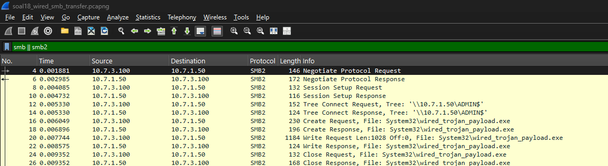

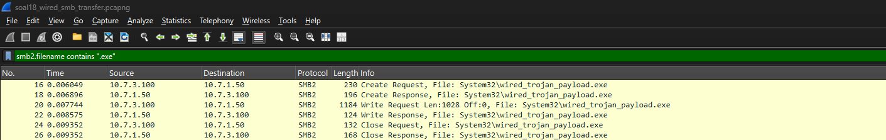


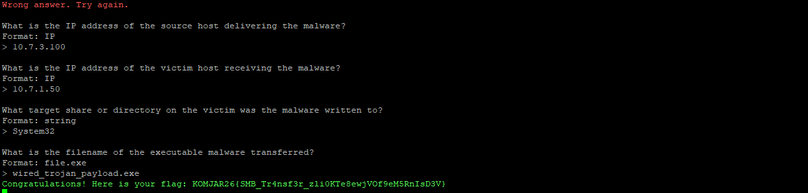

---

# Nomor 19: Analisis SMTP Threat

## File Input

```text
wired_smtp_threat.pcap
```

atau ekstensi aktual dari soal.

## Wireshark

Filter:

```wireshark
smtp
```

Pilih stream:

```text
Right Click -> Follow -> TCP Stream
```

Temuan:

```text
RCPT TO:<victim@protocol7.co.jp>
To: victim@protocol7.co.jp
I know that: protocol_7_user - is your password!
Your computer was infected with my private ransomware.
I give you 72 hours (3 days) ...
MailClientID: 7719980706
```

## Hasil

```text
Victim email    : victim@protocol7.co.jp
Leaked password : protocol_7_user
Malware type    : ransomware
Deadline        : 3 days
MailClientID    : 7719980706
```

## Validasi

```bash
nc 10.4.89.246 3406
```

Input:

```text
victim@protocol7.co.jp
protocol_7_user
ransomware
3
7719980706
```

## Screenshot

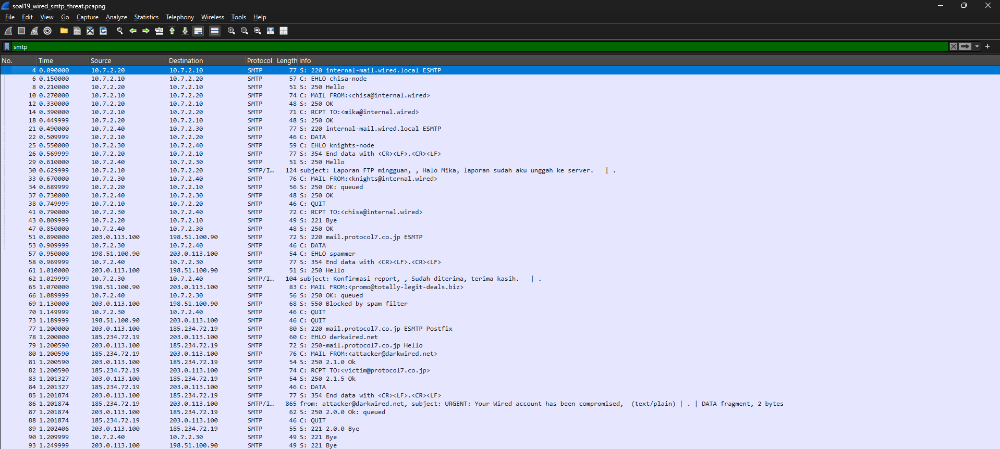

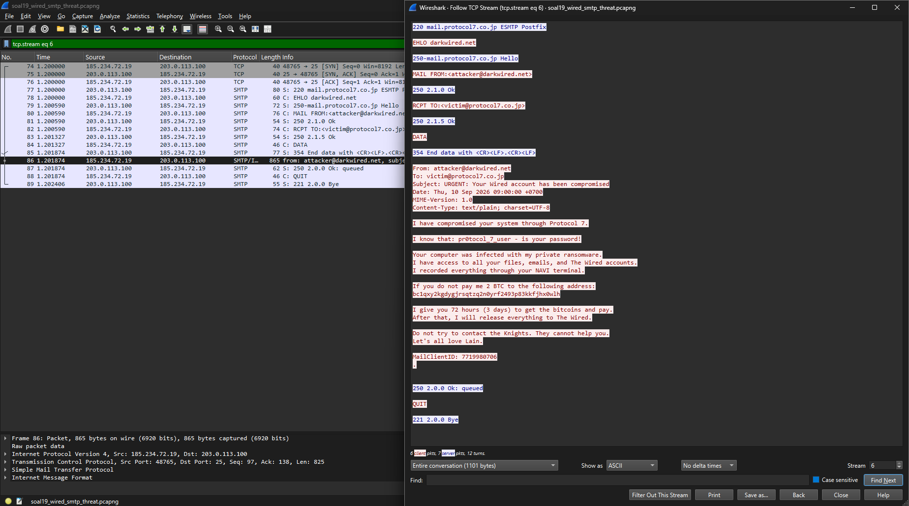

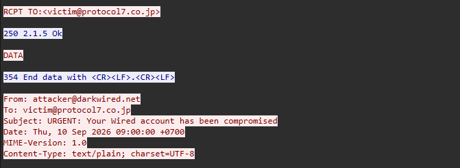


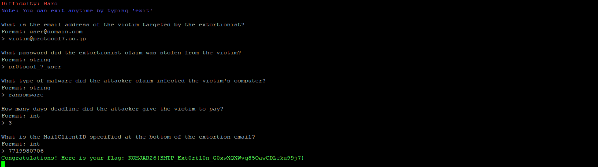

---

# Nomor 20: Dekripsi TLS dengan Key Log File

## File Input

```text
wired_tls_decrypt.pcapng
keyslogfile.txt
```

## Buka PCAP

Filter:

```wireshark
tls
```

Sebelum key log, ekspektasi:

```text
Client Hello
Server Hello
Application Data
```

## Pasang Key Log

Wireshark:

```text
Edit
-> Preferences
-> Protocols
-> TLS
-> (Pre)-Master-Secret log filename
-> Browse
-> pilih keyslogfile.txt / keylogfile.txt
-> Apply
-> OK
```

## HTTP Terdekripsi

```wireshark
http || http2
```

Temuan:

```text
10.9.0.2 -> 93.184.216.34  HEAD / HTTP/1.1
93.184.216.34 -> 10.9.0.2  HTTP/1.1 200 OK
```

## TLS Version

```wireshark
tls.handshake.type == 2
```

Pilih `Server Hello`.

Hasil:

```text
TLSv1.2
```

Jangan mengambil `TLS 1.0 (0x0301)` pada record compatibility Client Hello sebagai versi final.

## SNI

```wireshark
tls.handshake.extensions_server_name
```

Hasil:

```text
example.com
```

## Server IP

Pada Client Hello:

```text
Source      : 10.9.0.2
Destination : 93.184.216.34
```

Server IP:

```text
93.184.216.34
```

## HTTP Request/User-Agent

```wireshark
http.request
```

Temuan:

```text
HEAD / HTTP/1.1
Host: example.com
User-Agent: curl/7.62.0
```

## Hasil

```text
TLS Version     : TLSv1.2
SNI domain      : example.com
HTTPS Server IP : 93.184.216.34
User-Agent      : curl/7.62.0
HTTP Method     : HEAD
HTTP Path       : /
```

## Validasi

```bash
nc 10.4.89.246 3407
```

Input:

```text
TLSv1.2
example.com
93.184.216.34
curl/7.62.0
HEAD
/
```

## Screenshot

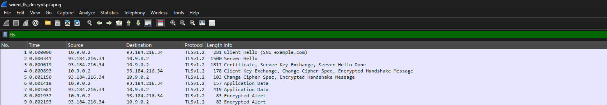

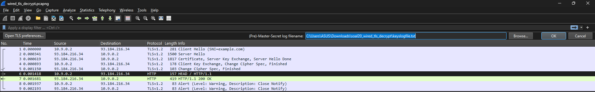

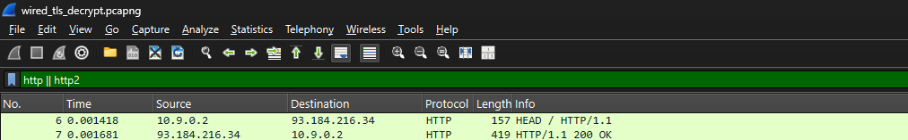

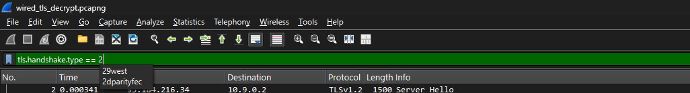

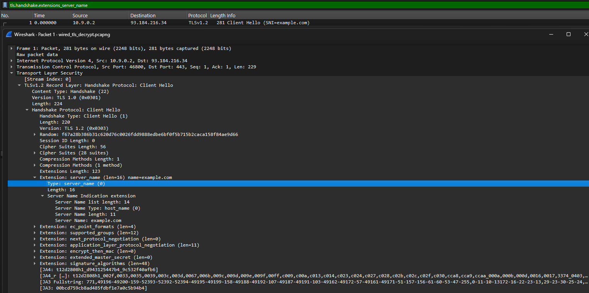

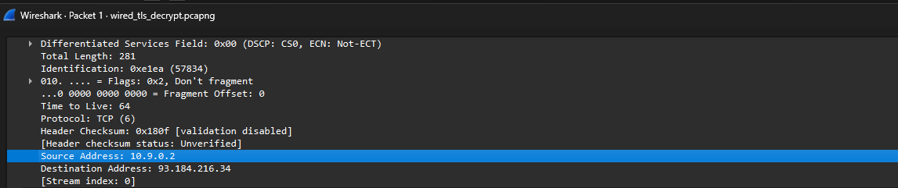

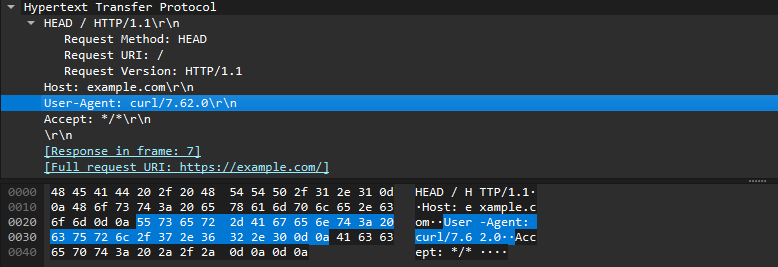

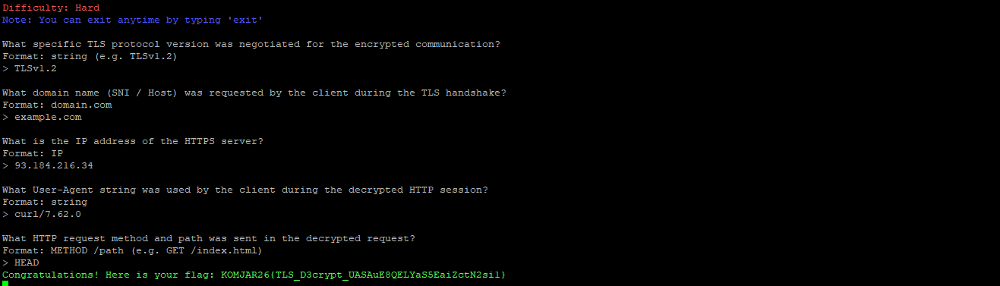

---
